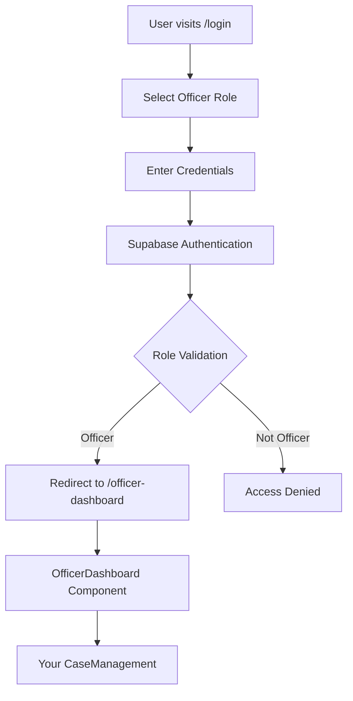

# 🔐 Officer Dashboard Authentication Integration Guide

## ✅ What's Been Implemented

### 🏗️ **New Architecture**
- ✅ **OfficerDashboard Component**: Dedicated dashboard for officers with authentication
- ✅ **Role-based Routing**: Officers are redirected to `/officer-dashboard` after login
- ✅ **Protected Routes**: Officer dashboard requires "officer" role to access
- ✅ **Authentication Integration**: Uses existing Supabase auth system

### 🚀 **Key Features**

1. **Role-Based Login Flow**:
   ```
   Login → Role Selection → Authentication → Officer Dashboard
   ```

2. **Officer Dashboard Features**:
   - 📊 Dashboard Overview
   - 📁 Case Management (your existing component)
   - 👮 Officer Portal 
   - 📈 Analytics
   - 👥 Citizen Services
   - 🤖 AI Assistant

3. **Secure Access**:
   - Only users with "officer" role can access
   - Automatic redirect after login
   - Session management with Supabase

## 🎯 **How to Test**

### **Step 1: Start Your Application**
```bash
npm run dev
```

### **Step 2: Test Officer Login**
1. Go to `http://localhost:5173/login`
2. Select "Officer" role
3. Login with officer credentials
4. Should automatically redirect to `/officer-dashboard`

### **Step 3: Verify Officer Dashboard**
✅ **Should see**:
- Custom officer header with navigation
- Welcome banner with officer name
- Tab navigation: Dashboard, Case Management, Officer Portal, Analytics, Citizen Services
- Sign out functionality
- AI Assistant button

✅ **Test Navigation**:
- Click "Case Management" → Should show your CaseManagement component
- Click "Dashboard" → Should show overview dashboard
- Click "Analytics" → Should show analytics
- All your existing functionality should work

### **Step 4: Test Security**
- Try accessing `/officer-dashboard` without login → Should redirect to login
- Login as citizen role → Should not be able to access officer dashboard

## 🔧 **Integration Details**

### **Modified Files**:
1. **`src/App.tsx`**:
   - Added `/officer-dashboard` route with role protection
   - Added routes for other roles (admin, citizen)

2. **`src/components/Login.tsx`**:
   - Updated to redirect officers to `/officer-dashboard`
   - Role-based routing after authentication

3. **`src/components/OfficerDashboard.tsx`** (NEW):
   - Custom dashboard for officers
   - Integrates your existing CaseManagement component
   - Uses authentication context
   - Custom header and navigation

### **Authentication Flow**:


## 🎨 **Dashboard Features**

### **Navigation Tabs**:
- **Dashboard** 📊: Overview with stats and quick actions
- **Case Management** 📁: Your existing FIR management system
- **Officer Portal** 👮: Officer-specific tools and features
- **Analytics** 📈: Data analysis and reporting
- **Citizen Services** 👥: Interface for citizen interactions

### **Header Features**:
- Officer profile with name/email
- Role indicator
- AI Assistant button
- Sign out functionality
- Responsive mobile navigation

## 🚨 **Troubleshooting**

### **Issue 1: Not Redirecting to Officer Dashboard**
- Check if user has "officer" role in Supabase user metadata
- Verify Login.tsx is using the updated redirect logic

### **Issue 2: Access Denied to Officer Dashboard**
- Ensure user is logged in with "officer" role
- Check ProtectedRoute component is working correctly

### **Issue 3: CaseManagement Not Loading**
- Verify all imports are correct in OfficerDashboard.tsx
- Check that CaseManagement component is exported properly

### **Issue 4: Missing Navigation**
- Ensure all menu items in OfficerDashboard match available components
- Check that setActiveView is working correctly

## 🎉 **Success Indicators**

When everything is working correctly:

1. **Login Flow**:
   - Officer selects role → enters credentials → redirects to officer dashboard
   
2. **Dashboard Access**:
   - Officer dashboard loads with custom header
   - All navigation tabs work
   - CaseManagement component loads when clicked
   
3. **Security**:
   - Non-officers cannot access officer dashboard
   - Unauthenticated users are redirected to login

## 🔄 **Next Steps**

Once the officer dashboard is working:

1. **Customize Officer Features**:
   - Add officer-specific statistics
   - Implement officer-only case filters
   - Add officer performance metrics

2. **Enhance CaseManagement**:
   - Add officer assignment features
   - Implement case status updates
   - Add officer-specific case views

3. **Add More Roles**:
   - Create AdminDashboard component
   - Create CitizenDashboard component
   - Implement role-specific features

Your existing CaseManagement component with all its features (including the delete functionality we implemented) will now be accessible through the authenticated officer dashboard! 🚀